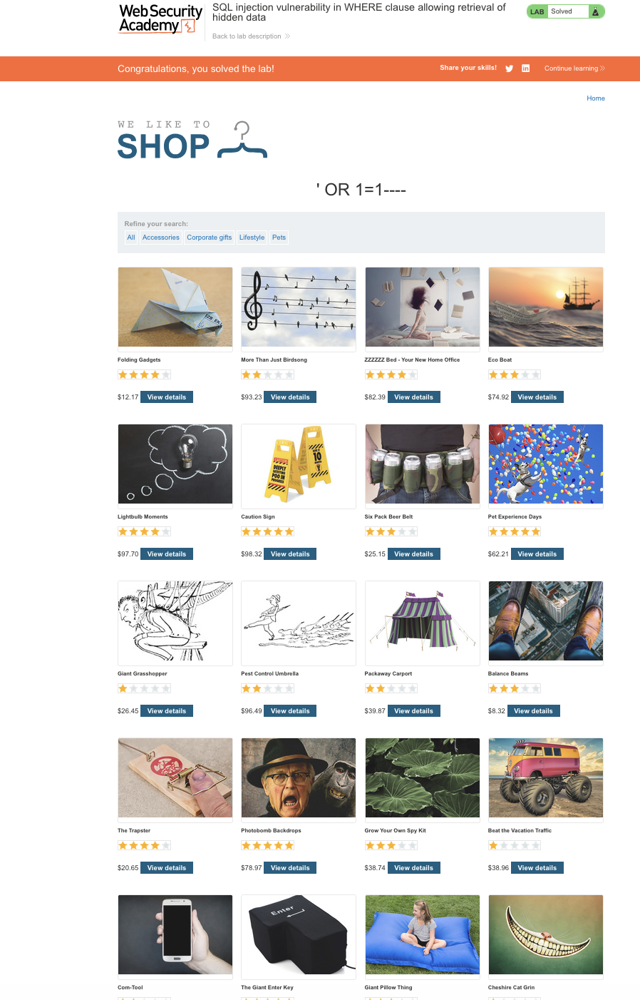

# Lab 01 — SQL Injection: Retrieving Hidden Data

## Date

23 Feb 2026

## Lab Source

PortSwigger Web Security Academy

## Lab Title

SQL injection vulnerability in WHERE clause allowing retrieval of hidden data

---

## Goal

Retrieve products that are hidden by the application.

---

## What I Observed

The website had a filter for product category (for example: `category=Gifts`).
When selecting a category, the page URL changed and a request was sent to the server.

This means:
The server was taking user input directly and using it in a database query.

---

## My Hypothesis

If the category parameter is directly used in the SQL query, I might be able to modify the query logic.

The original query likely looked similar to:

SELECT \* FROM products WHERE category = 'Gifts' AND released = 1

The `released = 1` condition hides unreleased products.

---

## My Attack

I modified the URL parameter and injected:

' OR 1=1--

---

## What Happened

The website displayed ALL products, including hidden ones.

This proved:
My input changed the database logic.

---

## Why It Worked

The application did not sanitize user input.
The injected condition `1=1` is always TRUE.

So the database query effectively became:

SELECT \* FROM products WHERE category='' OR 1=1

Which returns every product.

---

## Evidence

---

## What I Learned

- User input must never be trusted
- SQL queries should use prepared statements
- Even a simple URL parameter can control database behavior

---

## Real World Risk

An attacker could:

- View private products
- Access sensitive records
- Possibly dump an entire database
