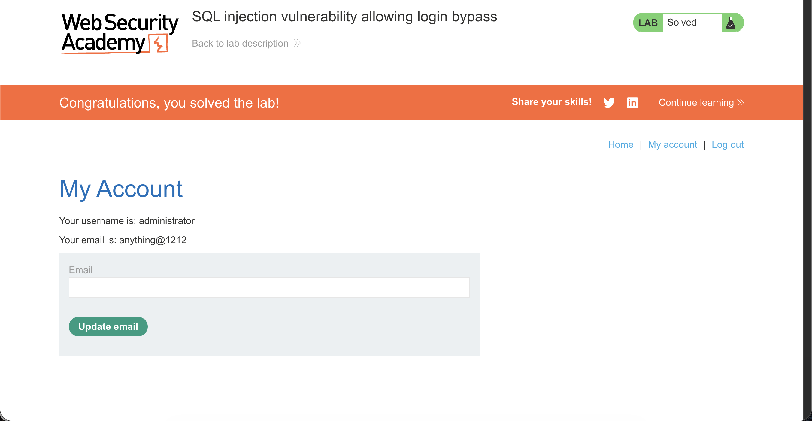

# Lab 02 — SQL Injection Login Bypass (Burp Suite)

## Date

24 Feb 2026

## Lab Source

PortSwigger Web Security Academy

## Lab Title

SQL injection vulnerability allowing login bypass

---

## Goal

Log in to the application as the **administrator** user without knowing the password.

---

## What I Observed

The application had a normal login form requesting:

- username
- password

Submitting credentials redirected to the account page if valid.

However, using Burp Suite I intercepted the request and discovered that the login page does not authenticate visually.
The authentication happens in the HTTP request sent to the server.

When I captured the login attempt, I saw:

```
POST /login
Content-Type: application/x-www-form-urlencoded

username=a&password=a
```

This line contained the entire authentication data.

---

## My Hypothesis

The server was likely using the input directly inside a database query such as:

SELECT \* FROM users
WHERE username = 'INPUT'
AND password = 'INPUT';

If the input was not sanitized, I could modify the query logic.

---

## My Attack

Using Burp Repeater, I modified the username parameter:

```
username=administrator'--&password=a
```

---

## What Happened

After forwarding the modified request, the application logged me in as the **administrator** user.

I did not know the password.

The authentication check was bypassed.

---

## Why It Worked

The `'` character closed the original username string inside the SQL query.

The `--` symbol started a SQL comment, causing the database to ignore everything after it.

The backend query effectively became:

SELECT \* FROM users
WHERE username = 'administrator'

The password condition was never executed.

---

## Evidence



---

## Key Payload Meaning

| Part          | Purpose                            |
| ------------- | ---------------------------------- |
| administrator | Target account                     |
| '             | Exits the string in SQL            |
| --            | Comments out password verification |

---

## What I Learned

- Authentication occurs in HTTP requests, not in the login page

- Burp Suite allows interception and modification of requests

- SQL injection can bypass authentication logic

- `'` breaks out of SQL strings

- `--` cancels the remaining query

---

## Real World Risk

An attacker could:

- Log in as any user
- Access private accounts
- Take administrative control
- Change or delete data
- Fully compromise the application
