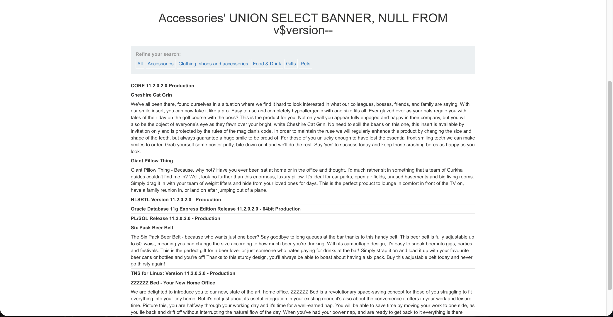

# Lab 03 — SQL Injection Database Version Disclosure (Oracle UNION Attack)

## Date

25 Feb 2026

## Lab Source

PortSwigger Web Security Academy

## Lab Title

SQL injection attack, querying the database type and version on Oracle

---

## Goal

Determine the database type and extract its version information from the server.

---

## What I Observed

The application displayed products based on a category filter:

`category=Gifts`

Changing the category changed the returned products.
This suggested the value was being used in a backend database query.

When I inserted a single quote:

```
'
```

the page returned an error.

This indicated that my input was being processed inside a SQL query.

---

## My Hypothesis

If the input is inserted directly into a SQL query, I should be able to modify the query and force the database to return its own information instead of product data.

However, to inject my own query, I first needed to understand the structure of the original query.

---

## Finding the Column Count

To determine how many columns the query returned, I tested:

```
' ORDER BY 1--
' ORDER BY 2--
' ORDER BY 3--
```

When the number exceeded the actual column count, the application produced an error.

This revealed how many columns existed in the original SELECT statement.

---

## My Attack

Since the database was Oracle, I used the system table containing version information.

I injected:

```
' UNION SELECT banner, NULL FROM v$version--
```

(The number of NULL values was adjusted to match the column count.)

---

## What Happened

The page displayed text that was not part of the website content.

It showed Oracle database version information.

This confirmed the database executed my injected query and returned internal system data.

---

## Why It Worked

The original query was likely similar to:

SELECT name, description
FROM products
WHERE category = 'Gifts'

The `UNION` operator combined the original query with my injected query.

The database executed both queries and merged their output.

Instead of only showing products, the application displayed database metadata.

---

## Evidence



---

## Key Payload Meaning

| Part          | Purpose                                     |
| ------------- | ------------------------------------------- |
| '             | Breaks out of the category string           |
| UNION         | Combines attacker query with original query |
| SELECT banner | Retrieves version text                      |
| NULL          | Fills unused columns                        |
| v$version     | Oracle system table containing DB version   |
| --            | Comments out remaining query                |

---

## What I Learned

- SQL injection can retrieve database information, not only bypass authentication
- Database errors reveal query structure
- UNION merges attacker queries with legitimate queries
- Oracle stores version details in `v$version`
- Column count must match for UNION injection

---

## Real World Risk

An attacker could:

- Identify the database technology
- Discover software versions
- Search for known vulnerabilities
- Prepare targeted exploitation
- Begin full database extraction
